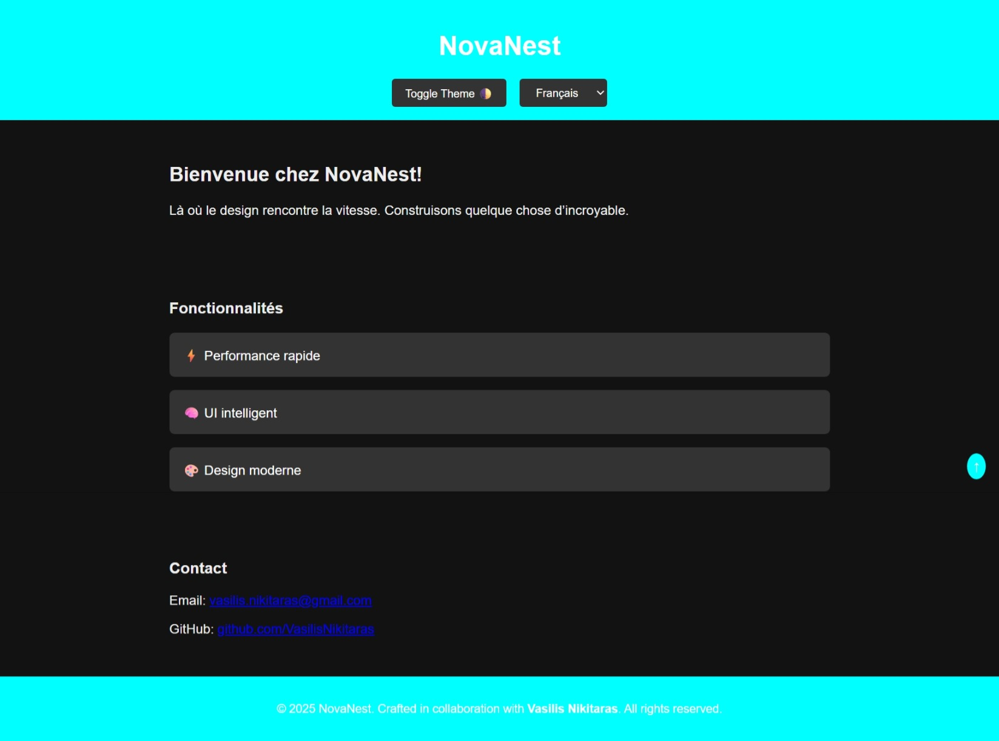
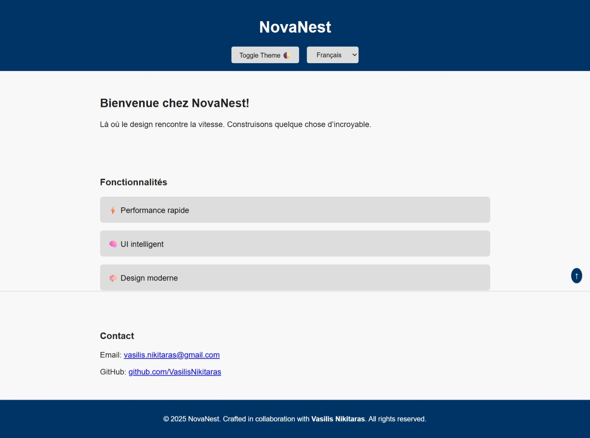

# NovaNest
Responsive, multilingual web app by Vasilis Nikitaras
# NovaNest

**Responsive, multilingual web app built by Vasilis Nikitaras.**  
Designed for speed, interactivity, and modern UI principles.

---

## 🔥 Live Preview / Προεπισκόπηση

> [NovaNest on GitHub Pages](https://vasilisnikitaras.github.io/NovaNest/)  
*(Enable GitHub Pages in Settings → Pages → Source: main → Save)*

---

## 📸 Screenshot / Στιγμιότυπο


---

## 📸 Interface Previews
🇫🇷 Français
Les images suivantes illustrent l’apparence de NovaNest selon les différents thèmes.

🇬🇧 English
The following images showcase NovaNest’s appearance under different theme settings.

GR Οι παρακάτω εικόνες δείχνουν την εμφάνιση του NovaNest σε διαφορετικά themes.

### 🌗 Dark Mode Preview



### ☀️ Light Mode Preview




## 🌟 Features / Δυνατότητες

- 🌍 Multilingual (English, Greek, French)
- 🌗 Theme toggle (Dark/Light)
- 📱 Mobile & tablet responsive
- 🧭 Navigation menu with anchor links
- ✨ Interactive feature modals
- 📩 Contact section with email link
- ⬆️ Smooth Back-to-Top button

---

## 🛠️ How to Use / Οδηγίες Χρήσης

1. Clone the repo  
   ```bash
   git clone https://github.com/vasilisnikitaras/NovaNest.git
   cd NovaNest
